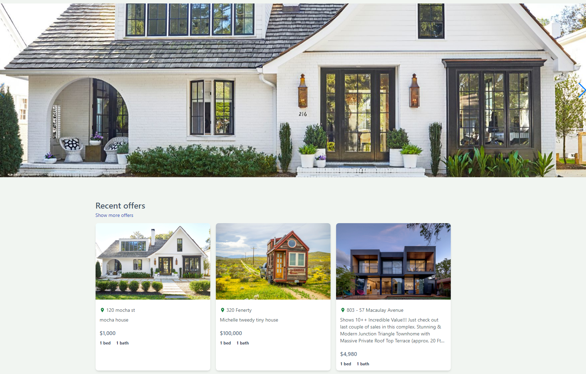
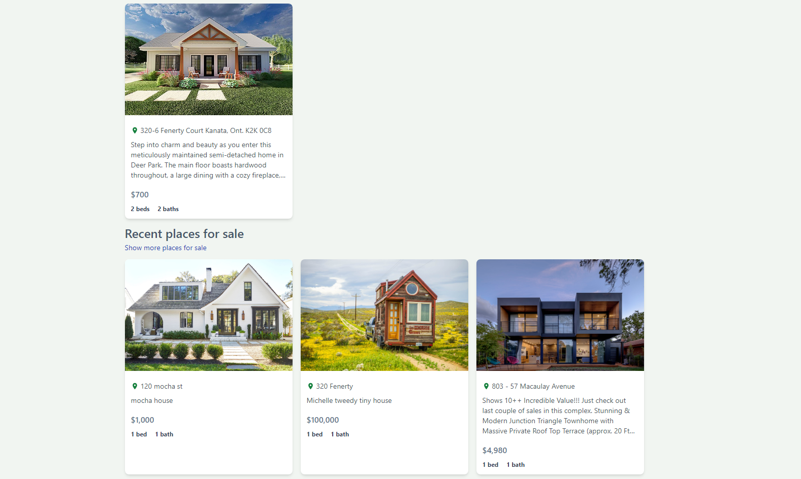

  
# Real Estate MarketPlace
  
A real estate marketplace where you search for house listing that is for "sale" and "rent". This app allows user to register for an account and post their own house listing or search for others that are currently in up in the market.
  

# Description

This is a full stack implementation of a real-estate marketplace application that is built on an MVM design pattern using mongoDB as a database and firebase for image storage. For styling the applications uses tailwind.

# Table of Contents

[Installation](#installation)

[Usage](#usage)

[Technologies](#technologies)

[Contribution](#contribution)

[Tests](#test)

[Questions](#questions)

[License](#license)

# Installation
### run application locally
1. First have Node.js installed
2. clone the repo and in your terminal type `git clone https://github.com/SophoanMeas/real_estate_marketplace`
3. type `npm i` to install all the node dependencies for this project
4. type `npm run dev ` in the client folder to start the client
5. type `npm run dev ` in the server folder to start the server

# Usage

### website

* <a href="https://mern-esate-mwb9.onrender.com/" target="_blank"><h4>Real Estate Marketplace*</a>

# Technologies
Node Package Manager
* framework (vite)
* react
* express.js
* bcryptjs
* cookie-parser
* dotenv
* jsonwebtoken
* tailwind
* swiper
* firebase
* mongoDB

Back-end Testing Tools
* Insomia/Postman
* Chrome Dev Tool

# Contribution

N/A

# Test

N/A

# Questions

---

<h1 align="center">Contact Me</h1>

Check out my Github for more projects

Have a question? Feel free to drop me an email.

📧[sophoan.meas@hotmail.com](mailto:sophoan.meas@hotmail.com)

---

# License

#### Copyright© [sophoanMeas](https://github.com/sophoanMeas). All rights reserved.
#### Licensed under *GNU*

---

## Screenshot

